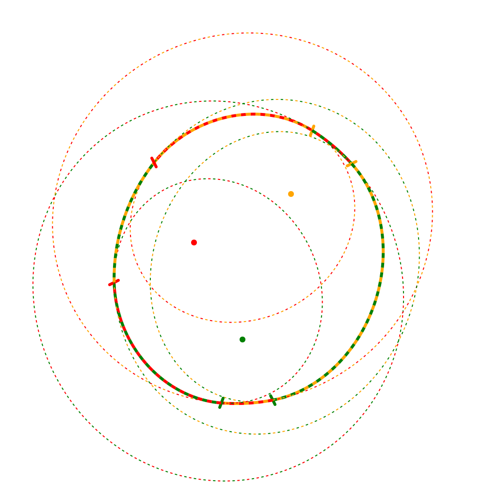
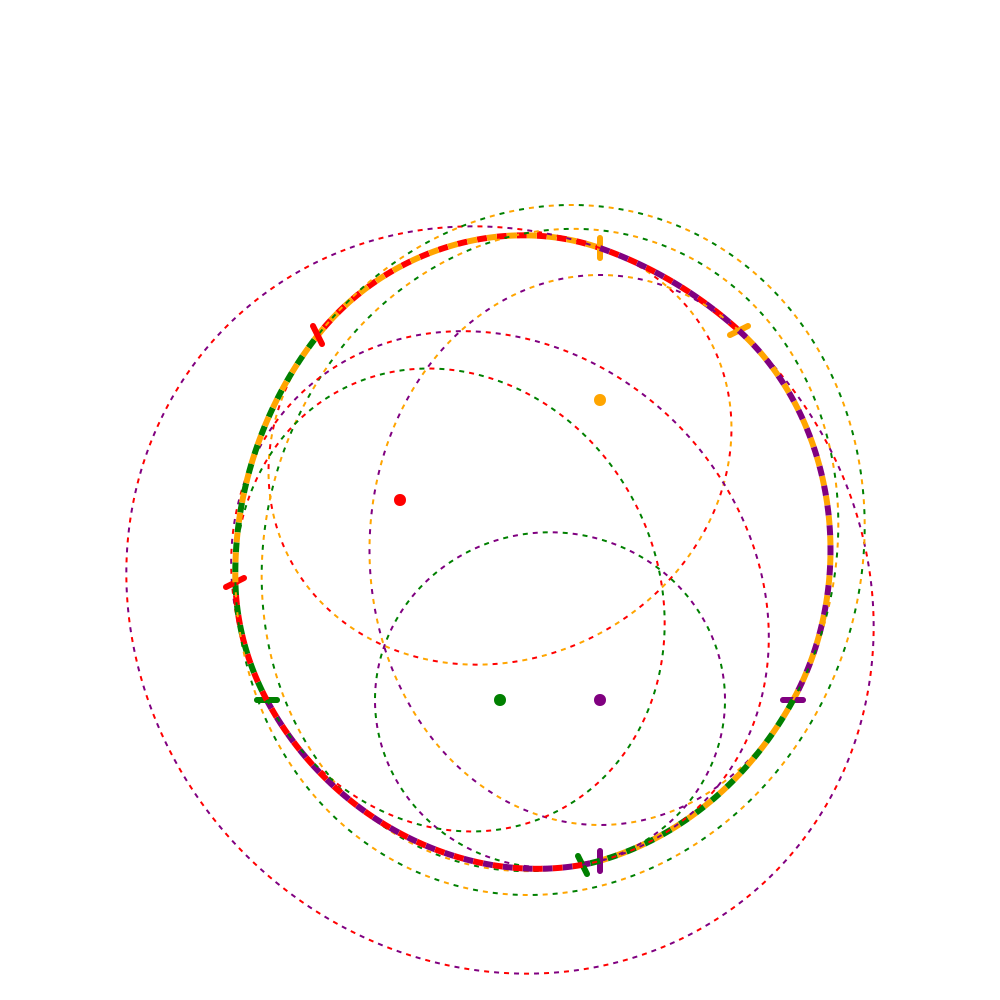

# multifocus_ellipse

Extending the [classical pins-string-and-pencil ellipse drawing technique](https://www.youtube.com/watch?v=0maahsJQOJE&t=30) to more than 2 foci.
The generic problem is, given a set of 2D points, make a string loop around them and the tip of a pencil
and trace a convex smooth curve around the points with this pencil while keeping the loop taught.

For 3 non-collinear foci the resulting curve looks like this:

It is in fact a smooth combination of 6 elliptical fragments, each built on just two foci out of three:

For 4 non-collinear foci the resulting curve looks like this:

It is a smooth combination of 8 elliptical fragments, each built on two foci out of four:

The following drawing shows the effect of different amount of slack in the loop, ranging from "almost a triangle" to "almost a circle":

